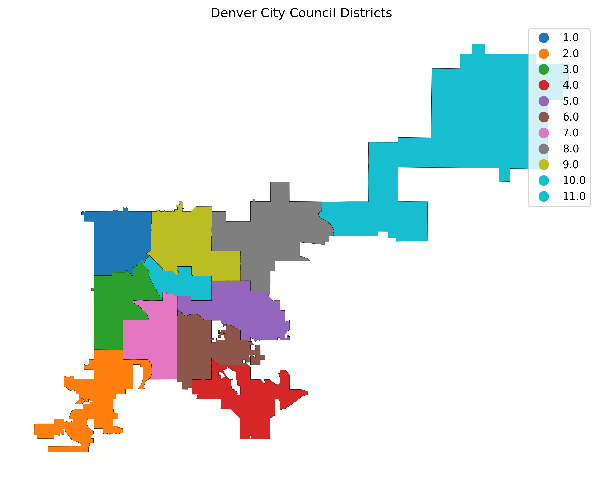

# VoteKit Workshop
Case Study on Denver, Colorado

Prepared by: Ainslee Archibald, Bryan Huang, and Natasha Romero Moskala

## Background

With 13 districts, out of which 2 are at-large, Denver is exploring the idea of switching to a Ranked Choice Voting (RCV) election system. Ranked choice voting would allow voters to rank Denver city council candidates based on preference. After each round, the candidate with the fewest votes would be eliminated, and their support would be distributed to those who remain in the race. Because all 13 city council positions are up for election every four years, the ranked choice voting process would continue until 13 candidates cross the threshold (Denver City Government). In other words, the people of Denver would be able to voice their political opinions through voting without potentially “wasting” their vote. However, despite a push for a new local-level electoral system, RCV has a history of unpopularity in the state of Colorado. In 2024, 55.6% of Colorado voters rejected Proposition 131, which sought to establish ranked choice voting in state-level elections (Sam Tabachnik 2024). Even though the proposition did not pass at the state level, the city of Denver continues to push for RCV at the local level. 

Support for the new electoral system is not homogeneous among elected officials in Denver, as members of the current city council are split on the idea of switching from a run-off system to a ranked-choice voting system. Council members Darrell Watson and Sarah Parady support the push to switch election systems in the city of Denver, arguing that it would incentivize younger voters to exercise their right to vote, particularly in local-level elections. Moreover, Watson and Parady argue that RCV would potentially bring election costs down, as it would eliminate the need for runoff elections (Paolo Zialcita 2025). However, other people from the city, including council member Amanda Sandoval, argue that an RCV system would be confusing, as it would be too different from state and federal election systems (Paolo Zialcita 2025). 

Whether Colorado adopts an RCV system is up to Denverites to decide in an upcoming election. Notably, despite voters also deciding on whether the two council positions for Denver’s two districts at large should be split into two races or remain as is, this study will solely focus on the matter of implementing RCV in the city of Denver.

## Goals of the Study
This report aims to understand how Instant-Runoff Voting (IRV)  might lead to different results than a plurality system, across multiple potential districting plans and varying turnout profiles. To explore and analyze the effect of RCV on Colorado’s City Council election results, we will use the software VoteKit in order to test election systems on demographic data at the precinct level provided by the Data and Democracy Lab.	

Furthermore, in order to gain a better understanding of the sentiment towards RCV, and changing the current Denver election system, we also looked at local newspapers, which provided context as to the history of Ranked Choice Voting in the state of Colorado, as well as the opinions that sitting council members have voiced regarding the tentative change to the city’s voting system.

## Study design

Denver has 11 districts and 2 districts at large (Denver City Government). Thus, the city has a total of 13 city council members. With roughly 150,000 voters participating in the 2023 city council elections, the following candidates won the races for the 11 districts and 2 districts at large:Ddistrict 1: Amanda P. Sandoval, District 2: Kevin Flynn, District 3: Jamie Torres, District 4: Diana Romero Campbell, District 5: Amanda Sawyer, District 6: Paul Kashmann, District 7: Flor Alvidrez, District 8: Shontel M. Lewis, District 9: Darrell Watson, District 10: Chris Hinds, District 11: Stacie Gilmore, At-large Council Members: Serena Gonzales-Gutierrez and Sarah Parady.

*Figure 1. Denver City Council Districts*

This study looked at bloc sizes of .66 and .34 for white and non-white people, respectively. Moreover, the parameters for white and nonwhite voting age population were .587 and .413. Thus, the relative rate of white voters that the study will be using is .732.

|               | White (W) | Non-White (C) |
|--------------|-----------|----------------|
| White (W)    |    1      |      0.5       |
| Non-White (C)|    2      |      0.5       |

*Figure 2. Bloc Sizes Matrix*

We estimate cohesion within and between the blocs with the following parameters: 

|               | White (W) | Non-White (C) |
|--------------|-----------|----------------|
| White (W)    |   0.75    |      0.25      |
| Non-White (C)|   0.30    |      0.70      |

*Figure 3. Cohesion Matrix*

Looking at candidate availability, this study bases its findings on the assumption that there were three white candidates and three non-white candidates in the single winner races.

For districting plans, we generated 20 random plans of 11 districts made up of precincts with Gerrychain, using a population tolerance of 5%. We then looked at the proportion of white and non-white voting age population for the districting plans. We found in our data that many of our 20x11 districts had nearly identical proportions, so to limit computation time, we rounded to two digits and thus collapsed our 220 proportions into just 30 unique proportions.

## Results
Our results show that, across 10 simulated elections for each of the 30 proportions, plurality and IRV methods result in similar proportionality for preferred candidates for voters of color. We calculated support by combining cohesion in the form of non-white voters voting for non-white preferred candidates, and crossover support from white voters voting for non-white preferred candidates. The proportion is the number of seats won by non-white preferred candidates over the ten simulated elections. These calculations were made using three voter behavior profiles in VoteKit.

## Conclusion
While this project sheds light on how different electoral systems would have led to different election outcomes, more research should be done in order to understand the underlying needs of the people of Denver and which electoral system best fits their circumstances. Thus, future election system research should aim to collect and consider input from Denverites in order to make appropriate recommendations for a new electoral system in the city. Moreover, this project aims to serve as a resource for the people of Denver to explore how different electoral systems may impact election results in their particular district.

## References

Denver City Government. n.d. “Denver City Government.” Denver City Government. Accessed June 19, 2025. https://www.denvergov.org/.
Paolo Zialcita. 2025. “Denver City Council Debates Ranked-Choice Voting and Other Major Election Changes.” Denverite, June 2, 2025. https://denverite.com/2025/06/02/denver-city-council-ranked-choice-voting/.
Sam Tabachnik. 2024. “Proposition 131: Colorado Voters Reject Ranked-Choice Voting, Election Overhaul.” The Denver Post, November 5, 2024. https://www.denverpost.com/2024/11/05/proposition-131-colorado-election-results/.

